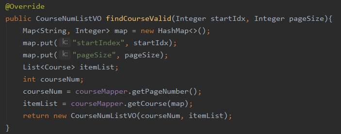
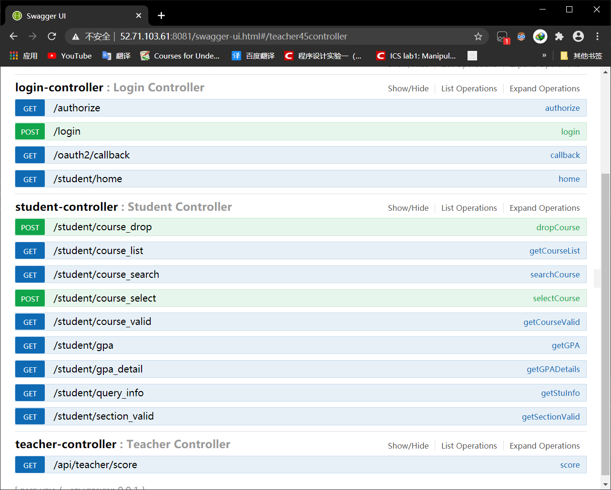

# 项目需求分析

## 功能性需求

### 选课 & 退课操作

* 实现了学生登陆到选课、查询已选课程、退课的全部流程

* 添加了课表查询、成绩与GPA查询、学生基本信息查询等功能

* 亮点：

  * 选课时是否出现时间段Overleap的判断

    * 利用int的二进制形式存储上课周数与每周上课的时间，并使用位操作 **&** 判断时间是否有重叠

    * .xml代码节选

      ```sql
      /* 函数isConflict，判断课程时间是否产生了冲突 */
      <select id="isConflict" resultType="int">        
      	select count(*)        
      	from (        
              select *        
              from sectime natural join (        
                  select *        
                  from takes        
                  where userName = #{userName}        
                  and semester = #{semester}        
                  and year = #{year}        
              )        
              as t1        
          )        
          as s1        
          where        
          (((weeks&amp;#{map.weeks})        
            and (weekDay&amp;#{map.weekDay}))        
            and (classNum&amp;#{map.classNum}))
      </select>
      ```

  * 对具有多个上课时间、多个教师的课程处理

    

    ——合理设计数据库实体集与外键约束使之能够存储：

    * 一门课多名教师任教（同一时间段）
    * 一门课多个时间段开课（同一教师）
    * 一门课多名教师在多个不同时间段上课

    

### 应对高并发与高访问量

* 虽然遗憾地没有完成预期应对高并发高访问量的需求，但我们的基本思路业已成型

  

## 非功能性需求

### 安全性

* 采用了OAuth2.0作为认证登录方式（详见OAuth2.0部分文档）

  

* 结果展示

  


### 友好性

* 添加了对网络异常时的提醒等提示信息，提高了用户的使用体验

* 示例：

  * 网络异常：

    

  * 退课确认：

    

  * 

### 实用性、可移植性、易使用性、可重用性、可扩展性

#### 亮点

***

##### 前端架构：

* 使用通用的**Vue**框架

* 将不同的**页面**与**组件**进行**模块化**处理

##### 后端架构：

* 使用Spring Boot框架进行架构

  ```
  src
  └─ main
       ├─ java
       │    └─ sjtu
       │           └─ dolo
       │                  ├─ CourseApplication.java
       │                  ├─ config   
       │                  ├─ controller   
       │                  ├─ mapper
       │                  │    └─ Mapping   
       │                  ├─ model  
       │                  ├─ service  
       │                  ├─ serviceimpl   
       │                  └─ utils
       │                         
       └─ resources
            
  
  ```

* 通过Java Spring进行三层**分层**

  |      前端       |
  | :-------------: |
  |  Controller层   |
  |    Service层    |
  | Dao (Mapper) 层 |

  * 每层进行依赖注入

  * 接口与实现分离

    

    * StudentService中：

      

    * StudentServiceImpl中：

      

  * 前后端通过接口文档（Swagger-ui自动生成）进行协作

    

* Controller层与Model层之间使用**Mybatis**框架进行持久化

  * 使用 **.xml** 文件配置查询、插入与删除，实现代码易于修改

    

#### 不足

***

* 代码风格有待进一步统一

* 注释量偏低，给理解带来一定困难