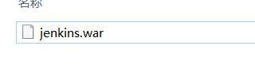
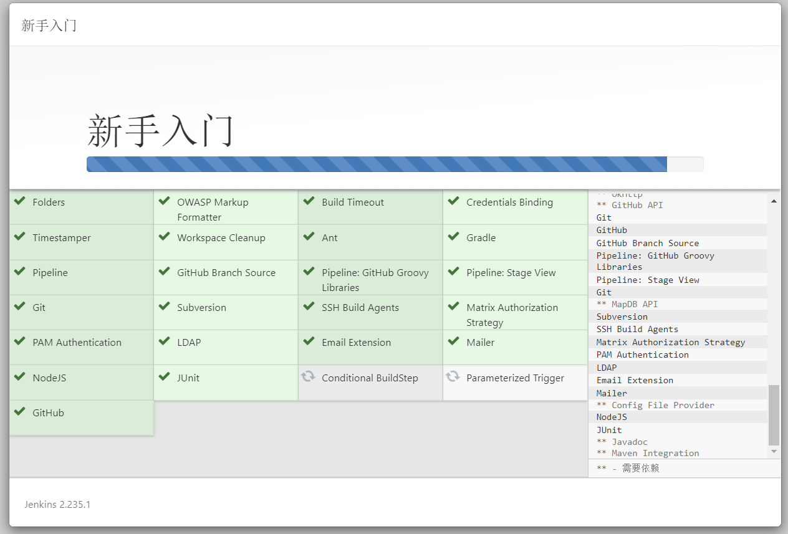
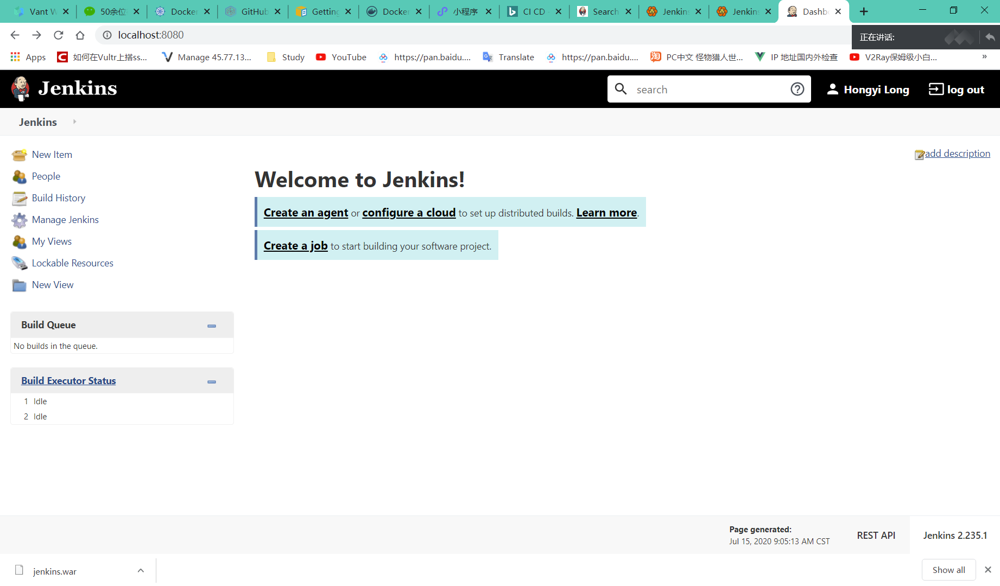

# Jenkins

## 时间

09点00分

## 负责

龙泓杙

## 介绍与安装

### Jenkins——扫盲篇（Jenkins是什么）

https://blog.csdn.net/houyefeng/article/details/50912756

Jenkins是一个开源的、提供友好操作界面的持续集成(CI)工具，起源于Hudson（Hudson是商用的），主要用于持续、自动的构建/测试软件项目、监控外部任务的运行（这个比较抽象，暂且写上，不做解释）。Jenkins用Java语言编写，可在Tomcat等流行的servlet容器中运行，也可独立运行。
通常与版本管理工具(SCM)、构建工具结合使用；常用的版本控制工具有SVN、GIT，构建工具有Maven、Ant、Gradle。

### W3Cschool Jenkins 介绍

https://www.w3cschool.cn/jenkins/jenkins-5h3228n2.html

#### 安装步骤

下载war包

在目录中使用终端指令

java -jar jenkins.war --httpPort=8080

访问localhost 8080 接口

根据提示，可能要到某个目录去找密码

选择需要的组件进行安装

（貌似默认不带NodeJS和Junit，也没有整合github，最好手选勾上）

安装好后应该是这样

### W3Cschool PipeLine构建

https://www.w3cschool.cn/jenkins/jenkins-173a28n4.html

### AWS 设置 Jenkins 构建服务器

https://aws.amazon.com/cn/getting-started/hands-on/setup-jenkins-build-server/