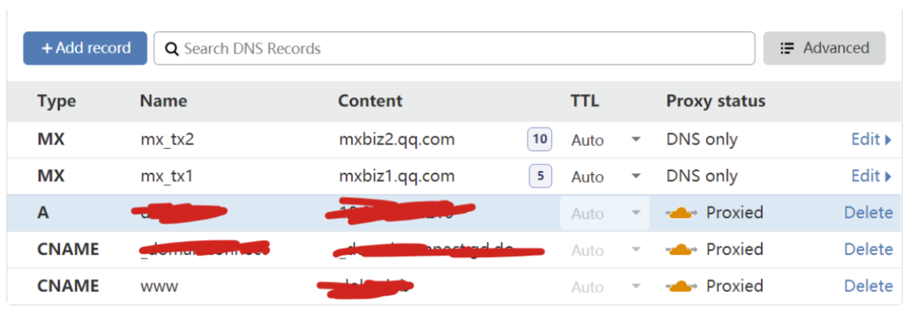
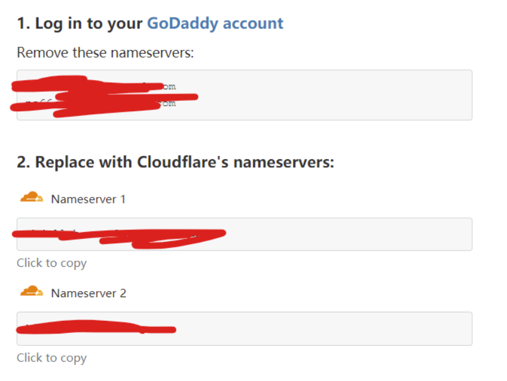
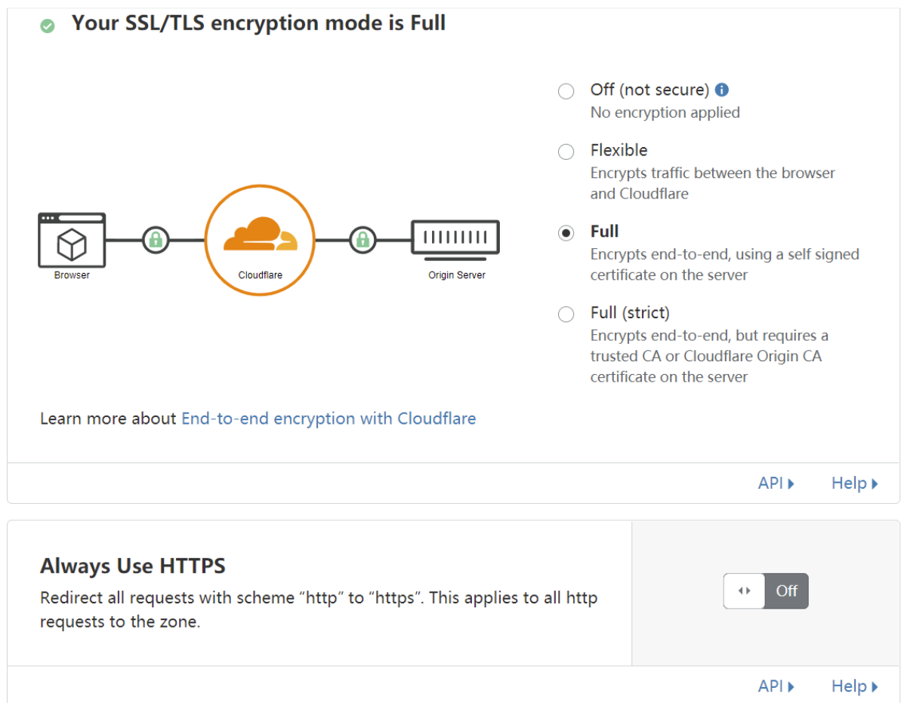
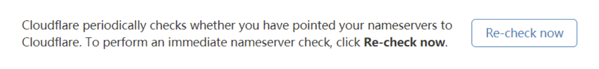
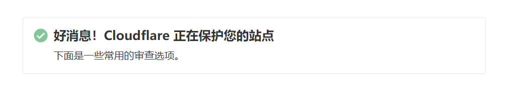
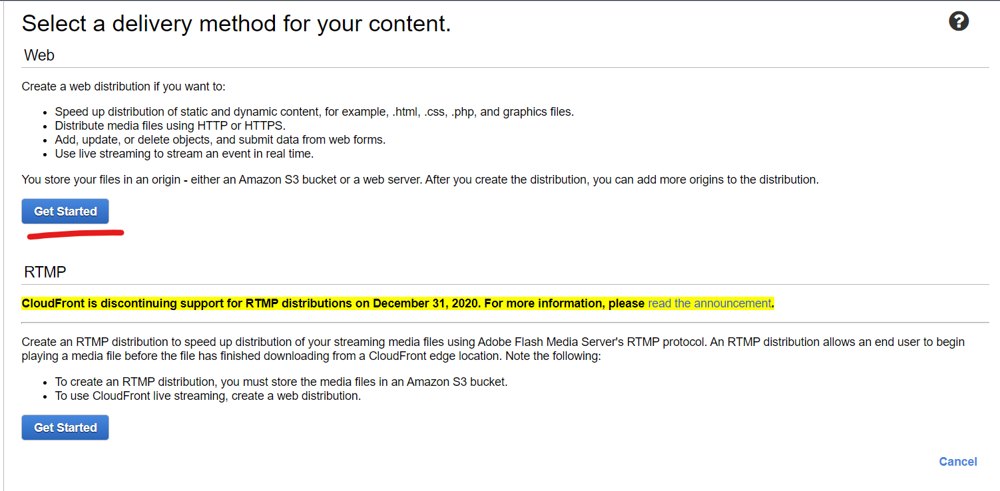
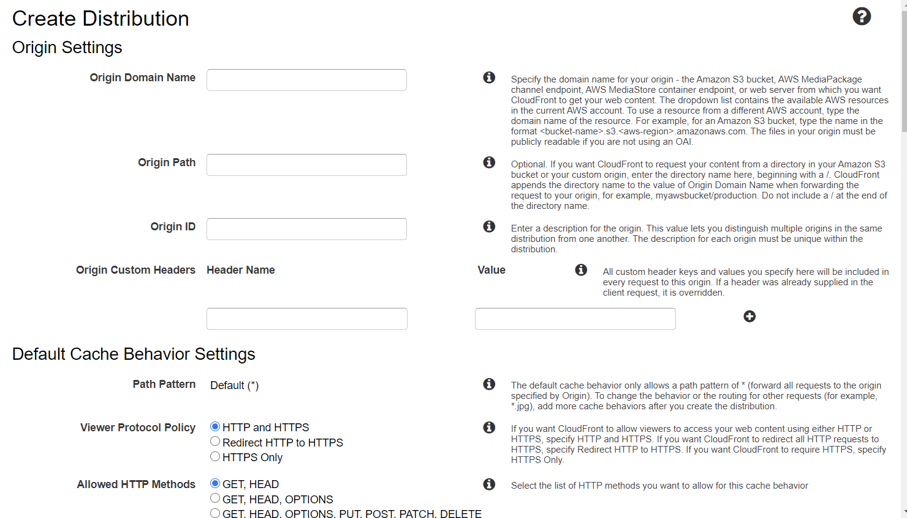

# CDN

## 时间

14点15分（之前完成的，在这时创建补充的文档）

## 负责

kony

## 内容

### CloudFlare 加速

要是有钱的话，还能购买更高级的网络和安全配置

初始配置像这样

按照教程来，把这些域名服务器都给整掉就行了

改好了，没毛病

这里可以设定SSL/TLS证书，设定HTTPS加密欸，暂时先不弄好了

好的，现在还在等待一些手续，等会儿就能在dash board上看到这些了

[timelog]14点11分

ok，成功了

[timelog]14点34分

### Amazon CloudFront

[timelog]14点40分

在做https证书的时候，猛然发现可以用Amazon自带的CDN加速去研究一下

https://aws.amazon.com/cn/cloudfront/

来吧，试试看这个

不行，这个需要一个S3实例，这下麻烦了，S3实例我还没弄过

我们先去看看域名吧

[timelog]14点47分