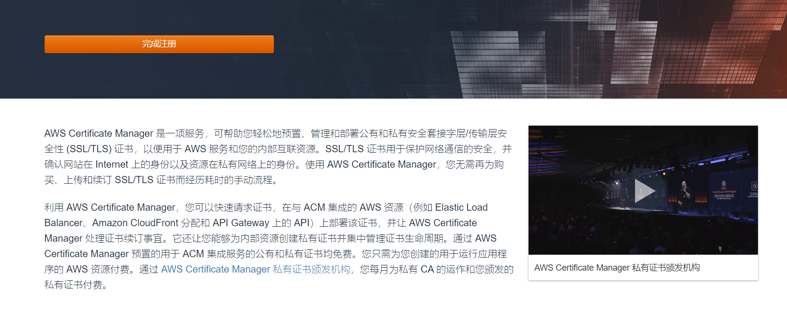
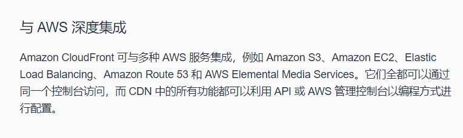
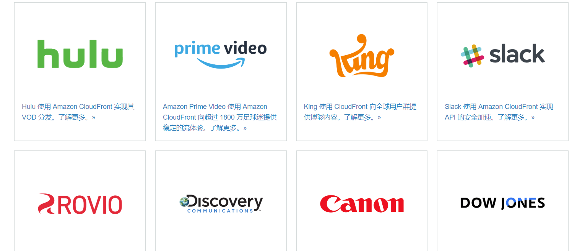

# HTTPS

## 时间

14点21分

## 负责

kony

## 内容

### AWS SSL/TLS证书管理服务

猛然发现AWS自带SSL/TLS证书管理服务，可以免费申请SSL证书

太爽了吧

#### AWS Certificate Manager

https://aws.amazon.com/cn/certificate-manager/

感觉很多东西都被AWS一门式服务给整掉了，我不禁思索，是不是可以在上面免费弄域名和CDN加速呢

这样运用AWS自带的CDN方案，我们要是能用上自己的100＄，能给我们一套高级的解决方案

#### Amazon CloudFront

https://aws.amazon.com/cn/cloudfront/

还真有，我裂开了，接下来去尝试尝试，用一下CloudFront

哇，这么多有名的网站都用了CloudFront

[timelog]14点39分，暂停开发，使用CloudFront

