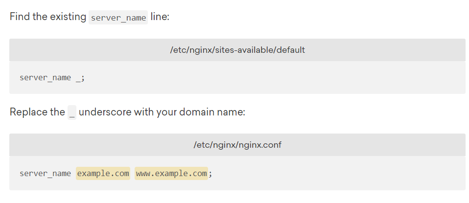

# HTTPS

## 时间

14点21分

## 负责

kony

## 内容

### AWS SSL/TLS证书管理服务

猛然发现AWS自带SSL/TLS证书管理服务，可以免费申请SSL证书

太爽了吧

#### AWS Certificate Manager

https://aws.amazon.com/cn/certificate-manager/

感觉很多东西都被AWS一门式服务给整掉了，我不禁思索，是不是可以在上面免费弄域名和CDN加速呢

这样运用AWS自带的CDN方案，我们要是能用上自己的100＄，能给我们一套高级的解决方案

#### Amazon CloudFront

https://aws.amazon.com/cn/cloudfront/

还真有，我裂开了，接下来去尝试尝试，用一下CloudFront

哇，这么多有名的网站都用了CloudFront

[timelog]14点39分，暂停开发，使用CloudFront

[timelog]16点08分，继续开发，开会完毕并且分配了一下任务，继续安排

#### How to get FREE SSL certificate via AWS Certificate Manager

https://www.youtube.com/watch?v=YYleHdvCUv8

按照教程打开这里，发现有错，OMG，是不是又是学生用户用不了这个

那么不就用不了AWS自带的负载均衡和故障恢复再启动、弹性容器策略!!!!

那就要自己搭了？！我太开心了

先查一下

换了几种关键词，查不到

看看AWS EDUCATE官方服务提供说明

首先，不能注册域名

其次，就算创建了IAM账号，也会受限于权限控制

（怪不得我都进不去billing界面）

只能使用us-east-1的实例

支持的服务列表里有CloudFront和CodePipeline还有CodeDeploy，还行

ECS和Elasticloadbalancing是可以做的，不错

那关于Certificate Manager呢？只字未提，估计是做不了了

然后查了一下，如果是外来的证书，需要先导入Certificate Manager，然后再关联负载均衡等等这些功能

那不就套娃了？Certificate Manager咱用不了

没事，那就自己弄负载均衡和弹性容器布局吧。

### 自己弄第三方的免费TLS

#### Transport Layer Security, TLS 1.2 and 1.3 (Explained by Example)

https://www.youtube.com/watch?v=AlE5X1NlHgg

#### FREE SSL/TLS Certificate in under FIVE minutes | Let's Encrypt Tutorial

https://www.youtube.com/watch?v=fwh7FuQ9XIU

#### Let‘s Encrypt

https://letsencrypt.org/

好，目前用https是登陆不上的

来吧！奥里给！

[timelog]16点28分

要先把证书配置给一个服务器，我们就配置给nginx吧！

使用工具certbot，哈哈!

#### CentOS 7 上使用Certbot申请通配符证书

https://yq.aliyun.com/articles/713724

s**t，不会AWS的linux没有certbot吧

#### 教程：在 Amazon Linux 2 上配置 SSL/TLS

https://docs.aws.amazon.com/zh_cn/AWSEC2/latest/UserGuide/SSL-on-amazon-linux-2.html

看来有是有，但是要绕弯子

就是想让人用你们的Certificate Manager呗

运行出错了，这该不会是和Apache高耦合的吧

运行一下

sudo certbot certonly --manual

我这里多了一个email地址，好吧

还多了一个用户协议，好吧

居然还有广告邮件。。

终于可以输入域名了

作者就输入了一个域名？！

好吧

我还要确认当前操作的IP地址会不会被logged，先不管了

多了一个这个啥，好复杂的逻辑，看来要让这个地址返回这个文件

看来作者也有，这一步的目的是为了证明你有对这个域名的全部操控权

淦，突然发现有更好的方法，

#### [Nginx 通过 certbot 为网站自动配置 SSL 证书并续期](https://www.cnblogs.com/wzlinux/p/11188419.html)

https://www.cnblogs.com/wzlinux/p/11188419.html

那之前的岂不是要撤销了，试试看

#### How To Secure Nginx with Let's Encrypt on CentOS 7

https://www.digitalocean.com/community/tutorials/how-to-secure-nginx-with-let-s-encrypt-on-centos-7#prerequisites

还是看官网教程靠谱一点

sudo yum install nginx

sudo yum install certbot-nginx

sudo yum install nginx

sudo systemctl start nginx

开启nginx出错

80端口已经被监听了，看看是什么程序

#### centos查看端口号是否被占用，是否对外开放

https://blog.csdn.net/pkx1993/article/details/95062308

sudo lsof -i tcp:80

80端口被apache占用了。。

看来是上次使用certbot的时候自带的apache服务器，给爷关了

sudo netstat -lnp|grep 80

sudo kill -9 26054

ok

没问题

[timelog]17点09分

sudo vim /etc/nginx/nginx.conf

成了

sudo nginx -t

OK的

sudo systemctl reload nginx

- sudo firewall-cmd --add-service=http
- sudo firewall-cmd --add-service=https
- sudo firewall-cmd --runtime-to-permanent

好像没有firewall-cmd

- sudo iptables -I INPUT -p tcp -m tcp --dport 80 -j ACCEPT
- sudo iptables -I INPUT -p tcp -m tcp --dport 443 -j ACCEPT

我的IP tables默认都是accept

应该也不用配置

先不管了

sudo certbot --nginx -d dolo.club -d www.dolo.club

哈哈!这不就成功了吗！

试了试，裂开了，有问题

不少人也有问题

#### Nginx - redirected you too many times

https://www.linode.com/community/questions/17870/nginx-redirected-you-too-many-times

都是在cloudflare和https处理后出现的

#### [HTTP to HTTPS Nginx too many redirects](https://stackoverflow.com/questions/41583088/http-to-https-nginx-too-many-redirects)

https://stackoverflow.com/questions/41583088/http-to-https-nginx-too-many-redirects

好吧，经过一通胡乱配置，无限循环被解决了

但是这边还是访问失败

可能是服务器安全组策略443未开放的原因，快去看看他

果然是安全组策略

淦

整活

终于成功了

但这看起来不像nginx界面啊。。

wtf，有什么办法吗

那没事了

### 更高级的HTTPS（暂未完成）

现在我的https还只有B等

好吧，照着做一下

https://www.ssllabs.com/ssltest/