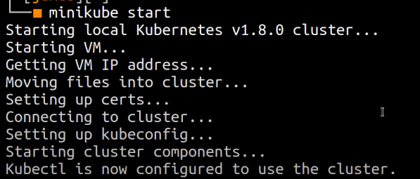

# Kubernetes

## 时间

17点54分

## 负责

kony

## 内容

### Introduction to Microservices, Docker, and Kubernetes

https://www.youtube.com/watch?v=1xo-0gCVhTU&t=66s

node - an instance of a computer 

kubelet - the application that running to communicate with the master node

pod - ran by node, contains one or more containers

service - handle request either inside the kubernetes cluster(one node to another) or from outside (public requests, like master node that wants to hit a specific micro service). service tend to be a load balancer, but it essentially a definition of how requests should be routed and handled within the cluster

deployment - defines desired state

replication controller can set like I want 3 copies of pods there etc. It can do version control too

Master also contain a service definition

here's a deployment file

JSON or Yaml is available

(Yaml suggested)

oh, look, it a setup for nginx

Kubernetes also can do automatic rebooting if pods crashes,

Quickly rolling updates(version 2 take place version 1 when version 2 is ready), from client perspective, there's no down time

#### deployment.yml

##### Part 1 . Deployment

metadata:

​	name: *- this deployment name is hello-world*

spec: *- specifications*

​	replicas: *- wants 5 copies of an app*

​	template: 

​		metadata:

​			labels:

​				app: - *app name is hello-world*

​		spec:

​			containers: *- it's going to have one container*

​				-	 name: *- container name should be hello-world*

​					   image: tutum/hello-world *- this image is a demo* 

​					   ports:

​							-	containerPort: 80 *- container inside port*

##### Part 2 . Service

this service can access that deployment (their pods) from outside the cluster

what pods to look at?

spec:

​	selector:

​		app: hello-world *- this service is to apply to any pod that has any application that has name hello-world (labels: name: hello-world in deployment)*

​	

ports:

**port:** *- a port to expose that is only accessible from inside the cluster*

*like 2 other pods want to communicate with hello-world pod inside the cluster, need this port*

*but from outside the cluster, can't access this via port 8080*

**targetPort:** *- the port forward to inside the pod* 

**nodePort:** *- a port accessible from outside the cluster*

*If i hit my master node at 30001, I would be able to hit the target port, which is the port forward to inside the pod*

the **type** is **loadbalancer** , it will balance the load between these five instances

#### munikube

creator use to impl kubernetes

minikube start

sudo kubectl getpods

​					initially there's no pod

sudo kubectl get deployments

​					initially there's no deployment

minikube dashboard

​					guess what?! we have an dashboard!

sudo kubectl create -f deployment.yml

​			-f means file, if you have created, use 'apply' instead of create

minikube ip

​			get the ip of the kubernetes cluster running at

#### automatically scale up

oh! if we delete one or one was crashed, it would automatically recrating

in this case, because we didn't specify the behaviour, the kubernetes just create a new resources

this, is automatically scale up

#### load balancing

we input the ip of kubernetes running at and ports about 30001,

we are interact with this instance!!

this tutum hello-world knows it runs in kubernetes, 

it runs in helloworldservice, it shows 8080, because from inside the cluster 8080 is available. 

that 10.0.0.183 is the ip address of master node from inside the cluster

we are outside the cluster, so we have to use 30001,

then, creator **refreshing** this page, the hostname sometimes changing!

maybe it is because the kubernetes uses sticky load balancing, it not always changing.

when creator use a anonymous window, it sure change ,but refreshing still not change sometimes.

It all because **sticky balancing** 