# Springfox

## 时间

18点26分

## 内容

### 3.0.0

官网

https://springfox.github.io/springfox/

官方docs：

https://springfox.github.io/springfox/docs/current/#getting-started

官方demo项目：

https://github.com/springfox/springfox-demos

UI是为了展示Springfox成果的

装一下，

既然都出到3.0了，咋个还叫这名hhh

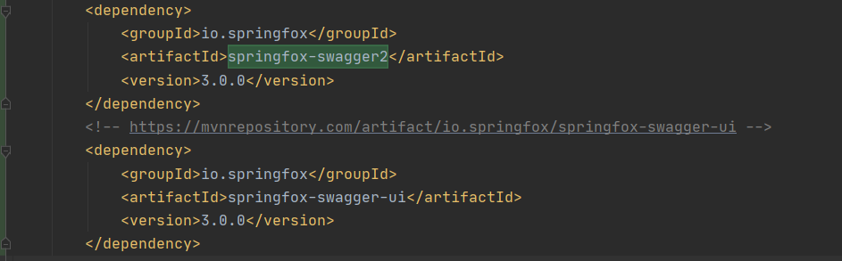

好吧，官网说要用这个玩意

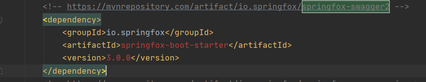

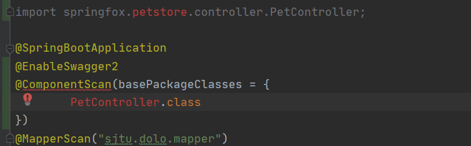

无论如何都解决不了这个问题，看来是依赖不完整，气死我了

尝试搜索google与bing，未果

使用IDEA自带的Find JAR on Web，未果

emmmmmm

去demo项目里看看

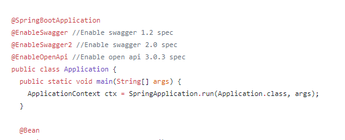

项目里明明没有嘛

照抄代码好了

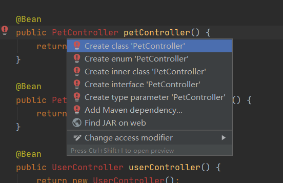

好吧，我还是太天真了

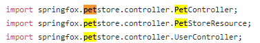

它还是引入了这个不存在的依赖

我去查查看

查不到，未果

3.0.0流产

[timelog]18点49分

### 2.0.0

https://www.jianshu.com/p/ce7e247515f5

尝试照着这个做做看

回滚git

尝试导入新依赖

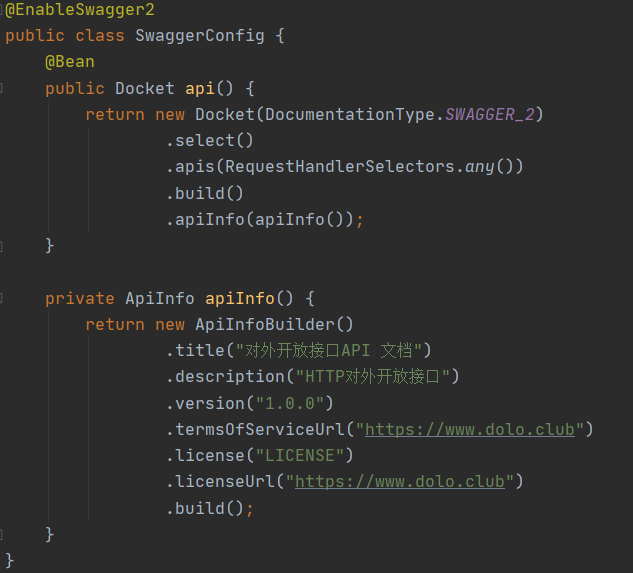

在这里弄一个配置类

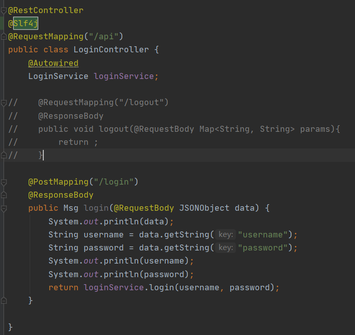

用swagger托管一下

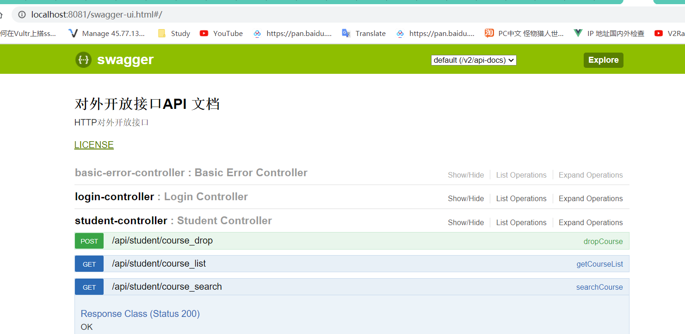

成功了

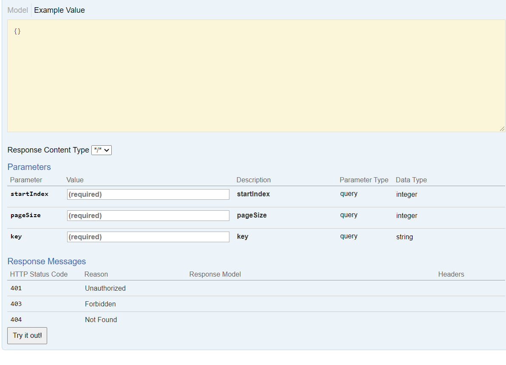

能够看到返回类型，请求类型等等，可以在这里填，然后做功能测试

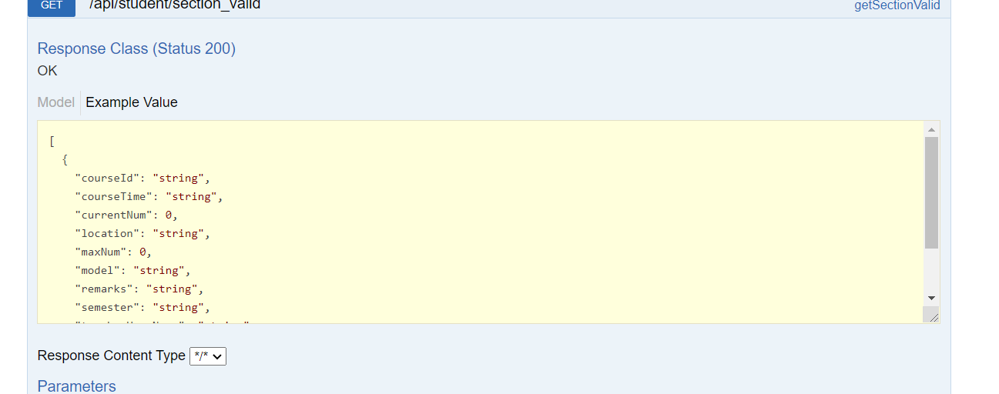

这个是有返回类型的，那为什么上面的没有？因为做的不好

### 程序问题

有些controller返回了Map，这是怎么设计的！太不合理了，至少得返回一个封装好的JAVA类才是

佛了

跟他们通知一下

[timelog] 19点01分