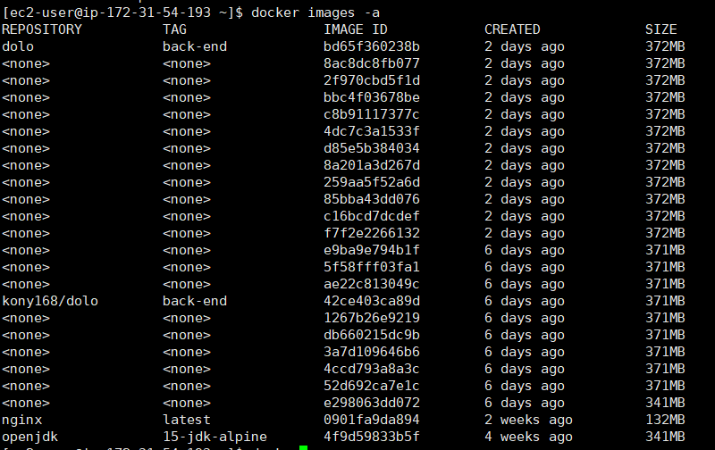
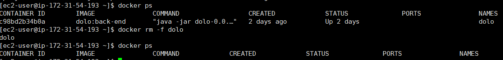
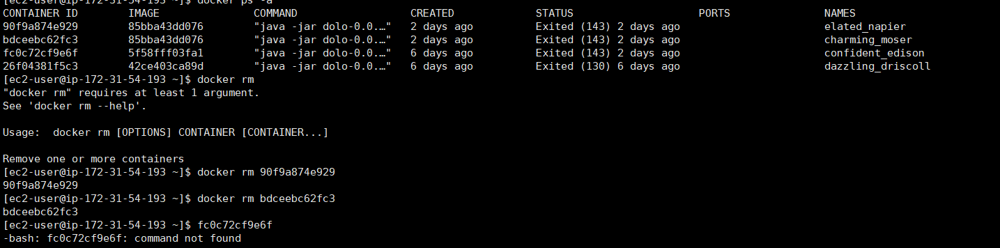
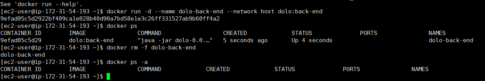
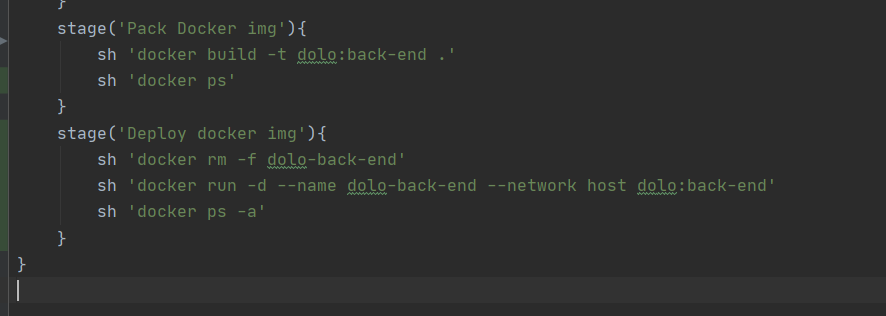
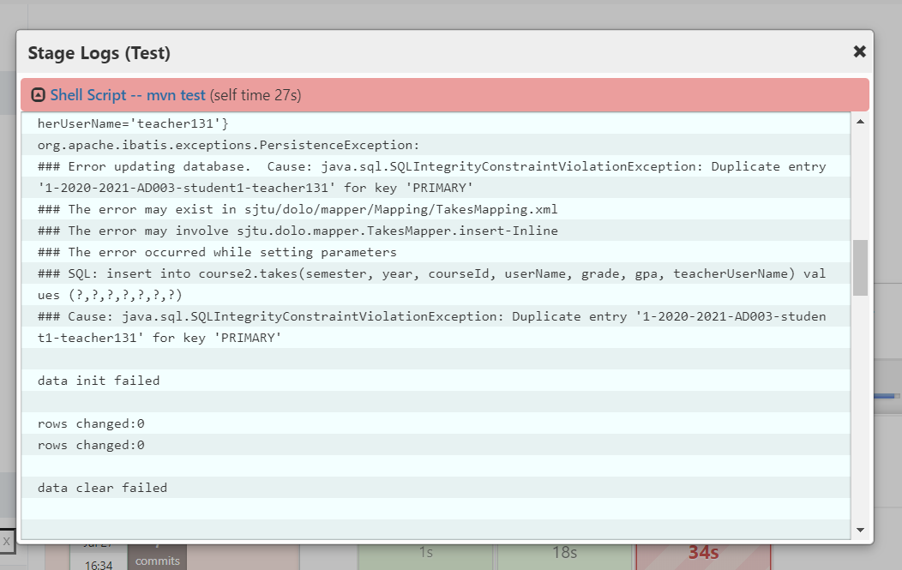
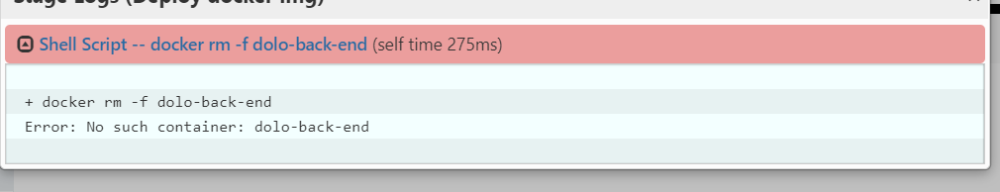
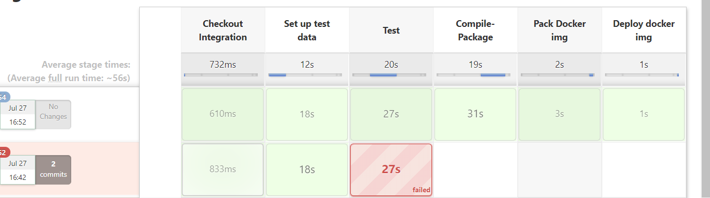
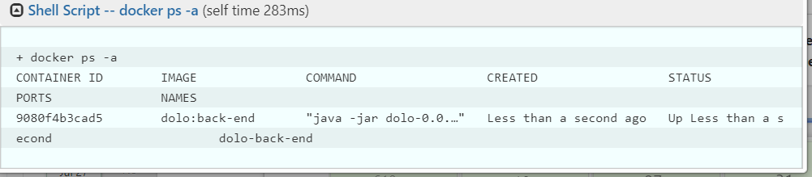

# CD

## 时间

16点18分

## 内容

### 后端CD

如果docker镜像没起名字，只能通过ID来去掉它

那怎么用命令行只获得docker镜像的ID，用于docker rm命令呢

还是起名字吧，我先做一下实验

----

是可以通过唯一的name删除的

--------

有些老的镜像

我只是关闭了

没有删除，现在删掉

--------

docker run -d --name dolo-back-end --network host dolo:back-end

用这个就好了，以后删除镜像就用

docker rm -f dolo-back-end

开锤

-------

改了一下，现在可以了，试试看

-----

已经两次测试通不过了，我裂开了，整啥呢

跟兴宇沟通ing

-------

[timelog]16点46分

更新了测试数据库，总算可以了

但忘了先启动后端工程了

-------

现在应该可以了

nice