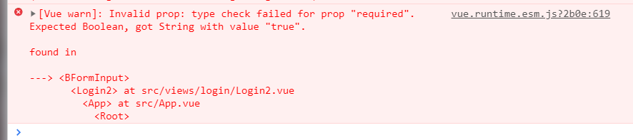
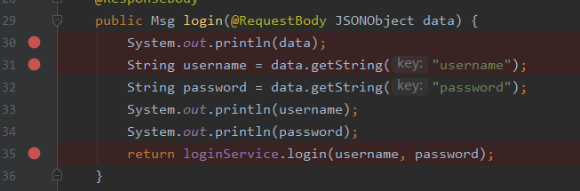
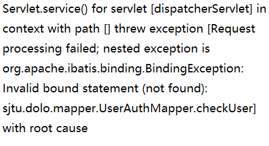

### front-end work documentation

I worte some pages, which was the easy part.then I tried to combine the front and the back.then problems came.

The first one:

The console:

no matter with or without ""

Then I found that the function in the back-end had problems!

I communicated with my teammates through debugging.At first, I thought I passed the params wrongly,because I never passed JSONobjects before.

However, the information showed another aspect. it's the mapper's problems

Now, I succeed.

I continued to combine the front and the back-end, and wrote more pages.