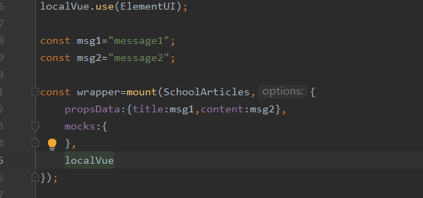

Except for new pages, I continued to combine the back and the front.

Besides, do tests.

here are documentations for problems I met today.

#### 1.

This time I user axios.get.However, something wrong....

I tried to debug and set breakpoint.However ,it didn't even stop.

It seemed that something bad happened when passing the params.

#### 2.test

(1)

When props have more than one value,it need to be like JSON.

(2)

There is always something with axios, I didn't find the way to solve it for now.

mock didn't work, and the return type is not right.

