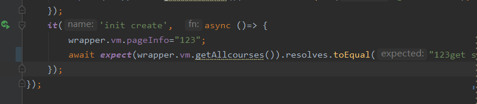
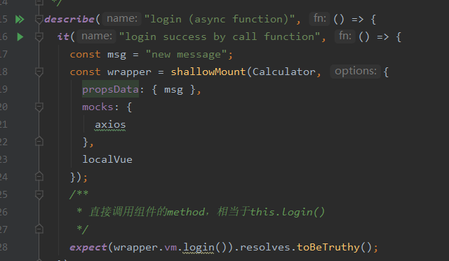
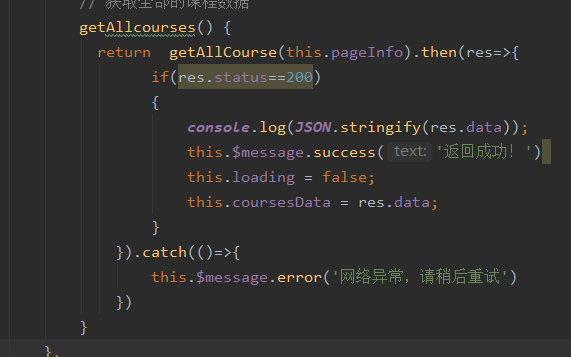
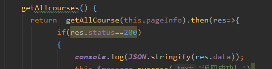
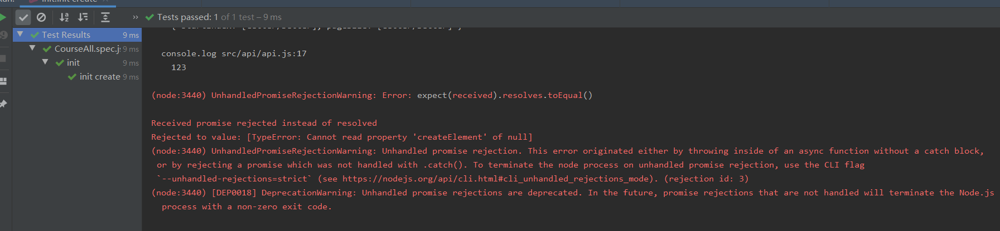
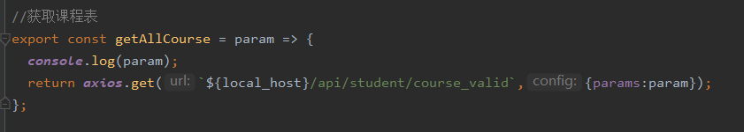
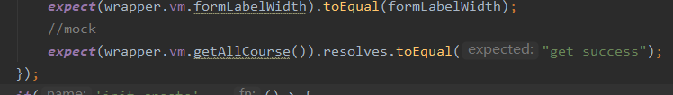
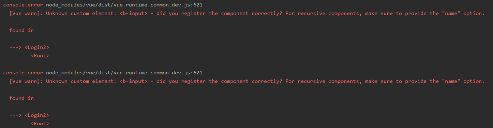
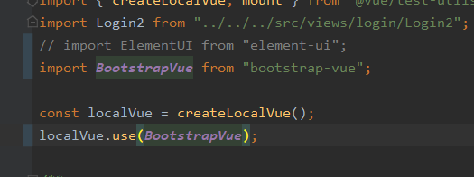
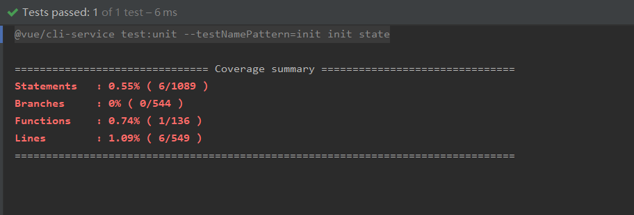

### 继续测试

由于需要完成报告，今天继续进行测试任务。

由于昨天一直存在undefined问题，今天先解决axios测试。

teammates提示我可能是异步测试原因，因此这次进行修改

添加了async和await，然而并没有什么效果。

仔细研究助教代码

同样采用的是直接调用，但是没有使用async和await。

看得出直接调用应该不是异步的，@click才是！

研究助教源码：

axios调用之后有一个return，是不是这个原因呢？

调整源码：

再运行，成功！

但是有error信息。

看来并不是想象中的成功，这里的请求被reject了。

另外，console打印出了提前设定的标识符123，也就是说这个axios请求没有mock住。

之前初始化进行过一次测试，是mock住了的：

------

#### 之前的错误修正

在login的测试部分

测试一直存在这样的问题

虽然测试显示pass。

回看源码，该页面为了达成响应式布局采用了bootstrap-vue，而注册组件确实element-ui

因此进行修改

好了 没事了：

