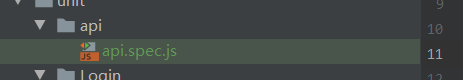
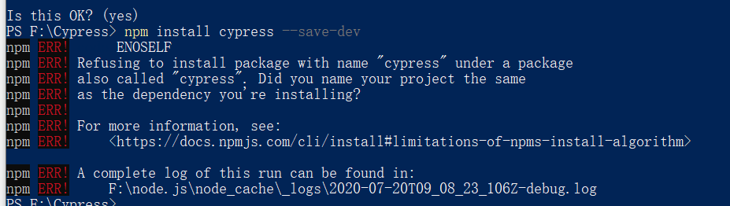
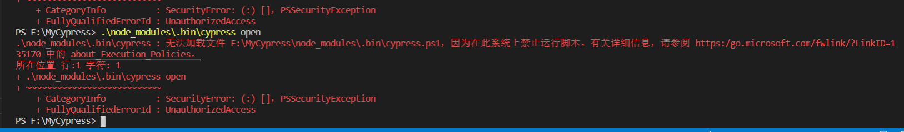
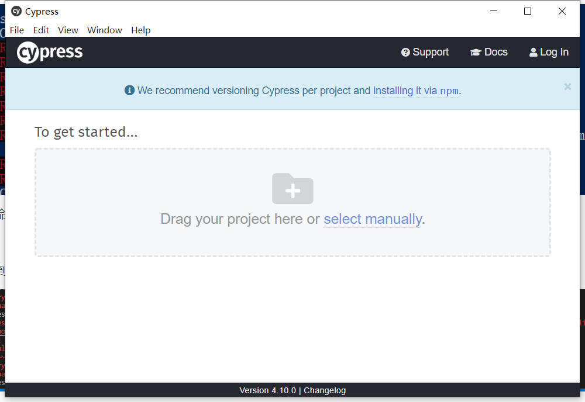
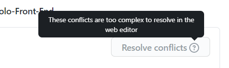
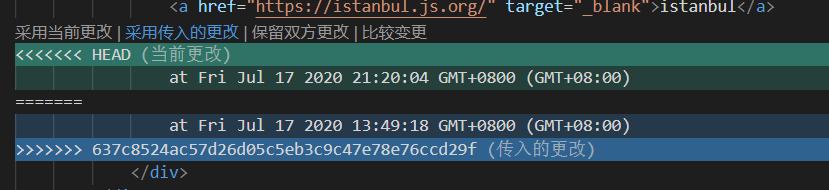
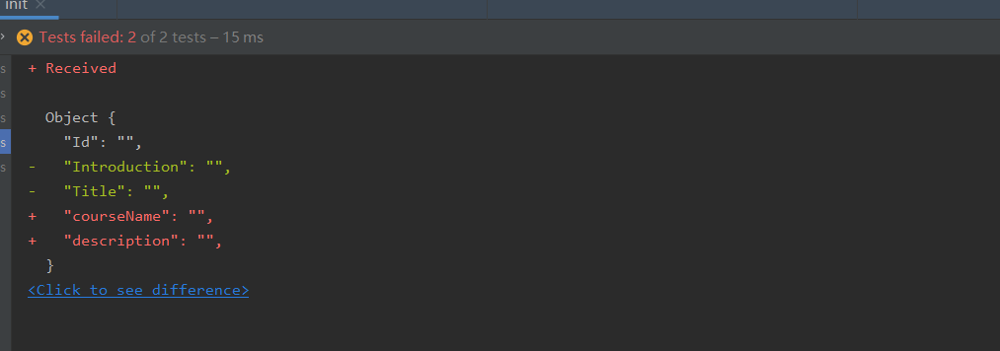

上周基本完成了单元测试，现在开始进行系统测试任务。

本来想尝试测试js文件，于是先尝试性写了一个：

很明显这样错误了，我写成了单元测试形式。后来查询相关资料才意识到这个问题......

先花点时间回顾一下之前上课的内容。

解析dom树，控制浏览器，感觉和之前写爬虫的时候有异曲同工之处，也许会容易上手？

先安装UI界面，便于操作，就不要用命令行给自己挖坑了

[]: https://www.cnblogs.com/fayez/p/12926999.html	"安装教程"

有问题，重命名一下文件夹

安装成功！

但是启动遇到了问题：

好吧，我直接找exe文件，启动成功：

------

之前合作开发的前端部分需要合并，解决冲突，这里先抽空去看一下那部分

好吧 看来只能在本地先处理掉了

全部pull到本地进行merge

为了方便，还是使用desktop和vscode

主要是使用vscode操作太方便了！

然而，坏消息：

之前做过的很多单元测试工作丢失了！：

尝试进行版本会退，但只看到了很多merge版本，找不到那个正确的版本了。

算了 电脑又卡，重新自己写一下吧。。原地裂开