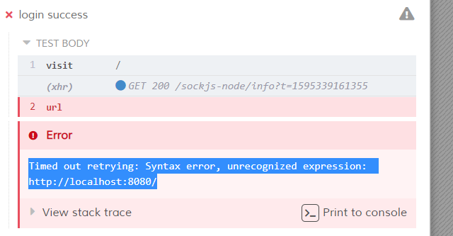

#### E2E测试

简单地了解了一下cypress的语法和思路

使用cypress模拟用户操作浏览器，属于”黑盒操作“，只需要满足需求。

在代码重构时，这部分代码不需要重写，但要保证通过。

思路还是比较清晰与合理的。

Cypress要求我们将测试写在指定文件夹中

先测试login功能。创建login文件，根据官方文档一步步尝试先：

[]: https://docs.cypress.io/zh-cn/guides/getting-started/writing-your-first-test.htm	"Cypress官方文档"

很好！之前在做爬虫的时候，要经常加入延时，为了防止页面未加载完成。（之前用selenium，其实也有相关函数，在一定时间内进行重复检测，但是这样就需要不断地重复书写这一段代码，非常麻烦）

Cypress自动保证这一健壮性，有内置的超时检测和重复检测，这就方便不少。

写两个试试：无法识别？

重新再项目内部又装了一次依赖，然而也没啥用，

询问了助教，貌似需要重新进行设置啥的。

不过在cypress.exe内部跑的异常欢快。

反正也挺好用，先不管了，完成任务先，继续写。

出现报错：这一句

查了一下，进行修改

好了，过了

应该是url没有have.value这种操作，因为不是一个元素

登录没有大问题，还是挺容易的。

之后再写一个登录失败的，基本是同样的逻辑，登录测试就算做完了。

接下来尝试生成报告：按照官方文档，安装依赖

**npm install --save-dev mocha mocha-multi-reporters mocha-junit-reporter**

发现不太好用，算了 换一个

[]: https://www.jianshu.com/p/aad94a3d1	"测试报告环境搭建"

生成成功！

