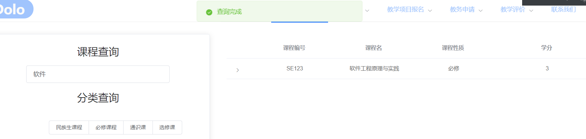

之前前后端的功能和整合还存在很大问题，之前和后端同学沟通过，处理掉那边的bug，今天来填一下坑。

进行了很多css的微调，以及整合了课程查询和课程显示。

具体就比较繁琐，直接上图吧

调整Dolo图标位置

制作嵌套表格

分页需要所有的课程数量，后端没有传过来，不太好吧，沟通一下。

ok，现在有了。

模糊查询：

再调整一下页面的渲染和各种响应。

虽然还有些简陋，但功能基本都体现出来了。

课程表页面：

由于elementui原本的table不好用，因此网上找了个轮子自己改。

首先把页面修改成响应式

监听屏幕的长与宽。

每门课通过固定公式计算出位置，并进行染色

单击课程可以查看详细信息和退课

有相应的事件，还是比较容易的。

课程表功能基本实现了。

不过这个页面目前不是很好看，还需要修改。主要是字体和背景色。

另外没有边框，视觉效果比较差。