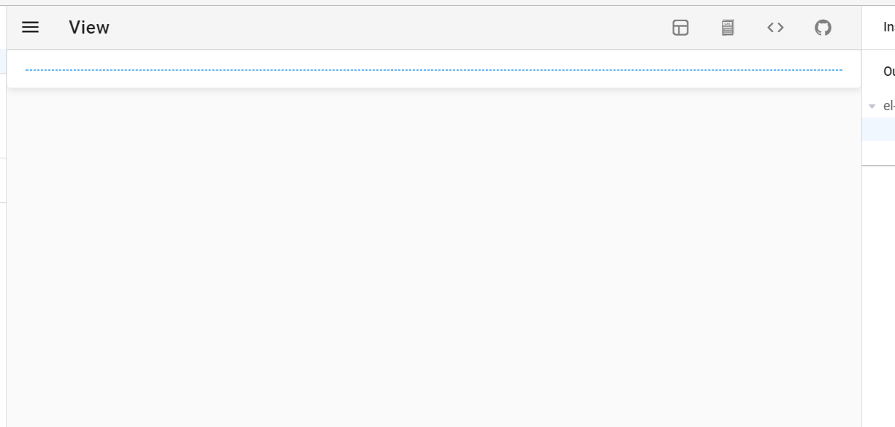
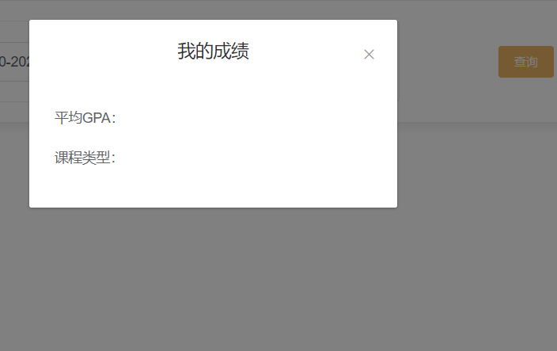
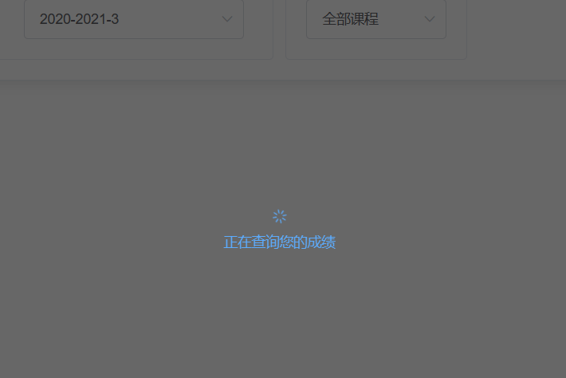
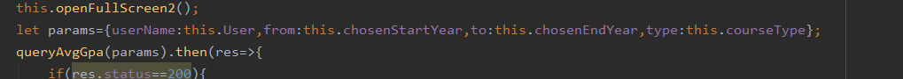
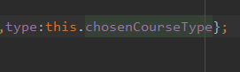

需要完成一个新的页面，于是尝试使用直接了解过的代码自动生成工具。

首先是vue-layout。

仔细使用了一下，功能还是有限，好像对于表单类型的更友好。

再试一下vue-design。

需要下载到桌面，使用起来好像有bug，拖动进入的组件很多都无法显示

那还是自己原生手写吧。

用卡片进行简单的搭建，并附上阴影效果

连接上路由

先完成一个简易页面。

起始学期和终止学期目前先在前端写死，之后可以修改成根据当前时间监听。

查询之后产生一个弹框

然后增加简单的过渡动画

先保证功能的实现。

与后端进行连接尝试：

第一次一直报跨域问题，仔细检查前端：

参数写错了。。

修改

好了，前端可以拿到数据并正常展示了