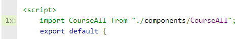

由于新写了页面和添加了功能，测试自然也需要跟进

再加上之前的测试覆盖率不够，今天补充一下

先弄单元测试

首先，引入组建部分显示没有测试到。

查阅官网资料，增加函数：

好了 过了：

类似的问题用相同的方法解决 

写新页面的单元测试：

报错：

显示找不到按钮。

分析，应该是嵌套组建太多，导致无法识别。那就用mount进行全局渲染

报错：

上网查询解决方案，加一个属性stubs

跑过了。

现在解决之前的mock问题。

使用jest.mock:

[]: 

当看到控制台的打印的时候，我不禁笑出了声，mock成功了！！！

源码中写了一个console的！！

但是.catch该怎么测试呢。。

比较笨拙的方法是新建一个文件，修改jest.mock的值。

[]: https://stackoom.com/question/35zqA/%E5%A6%82%E4%BD%95%E5%9C%A8%E6%AF%8F%E6%AC%A1%E6%B5%8B%E8%AF%95%E4%B8%AD%E6%9B%B4%E6%94%B9jest%E6%A8%A1%E6%8B%9F%E5%87%BD%E6%95%B0%E8%BF%94%E5%9B%9E%E5%80%B	"动态修改jest.mock"

尝试使用这个方法进行更灵活的mock

为此还加入了一个import

然而报错了

继续查询资料

[]: https://www.cnblogs.com/Wolfmanlq/p/8025329.html

似乎应该这样用 试一下

修改：

仍有大量报错。