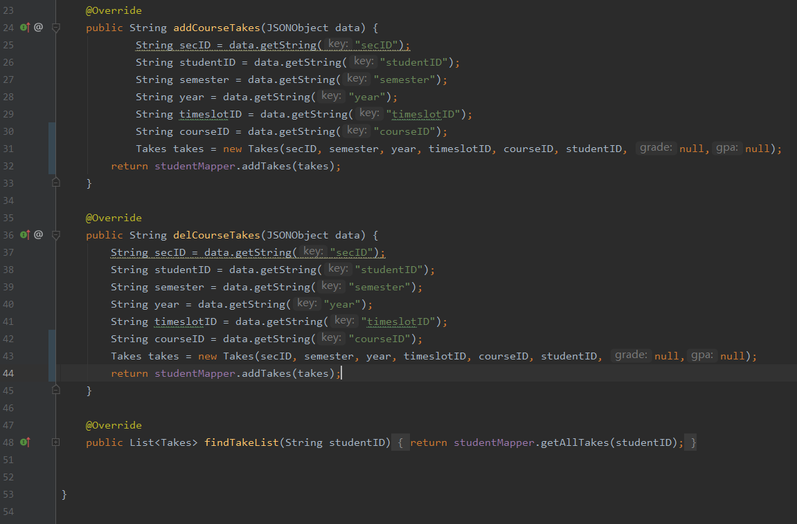

# studentService基本功能迭代

### 初始版

仅有service的interface声明

仅有serviceImpl的class声明

### 迭代一

在service层中添加向takes中添加记录的addCourseTakes()及其实现

在service层中添加从takes中删除记录的delCourseTakes()及其实现

在service层中添从takes中获取记录的findTakeList()及其实现
