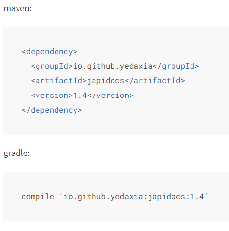
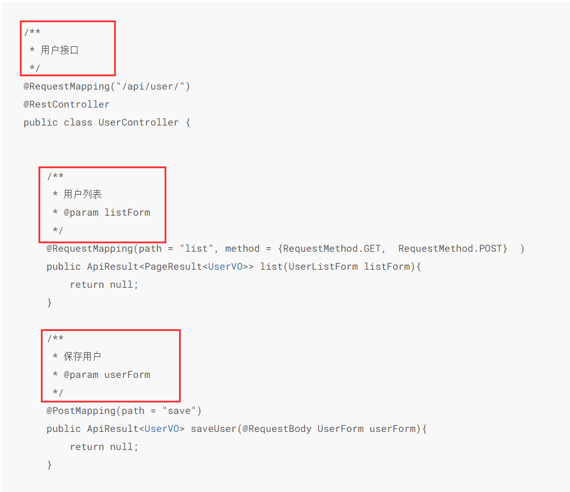
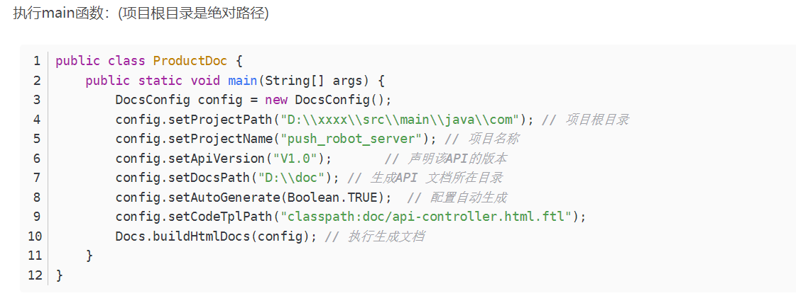
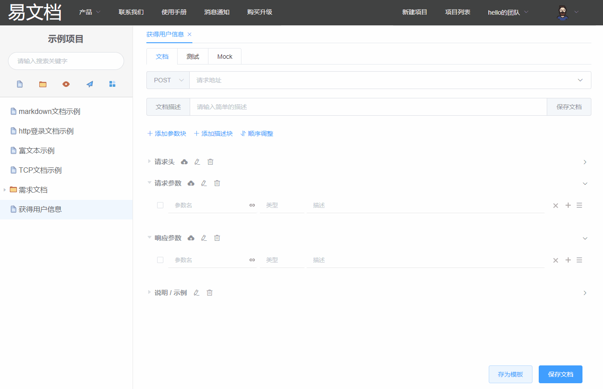

# 接口文档生成工具调研

### 常用接口文档生成工具

---

### JApiDoc、Swagger

1. 导入包

2. 添加必要注释

3. 运行提供的main函数

* 但是我在使用JApiDoc遇到了无法识别.java文件的情况
  * 计划第二天接口完成后使用Swagger再次进行尝试
* 以上两种工具均对controller层代码具有一定侵入性
---
### easyDoc

1. 进行接口测试

2. 一键生成文档

**此平台需要付费**

