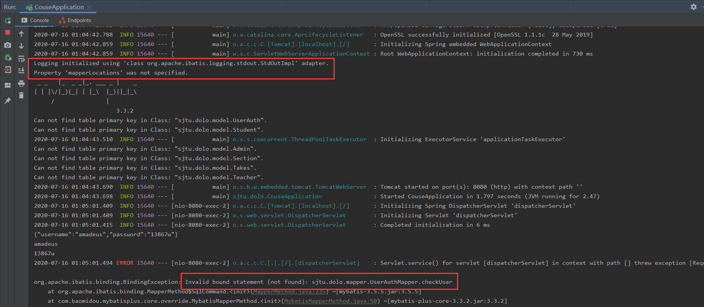
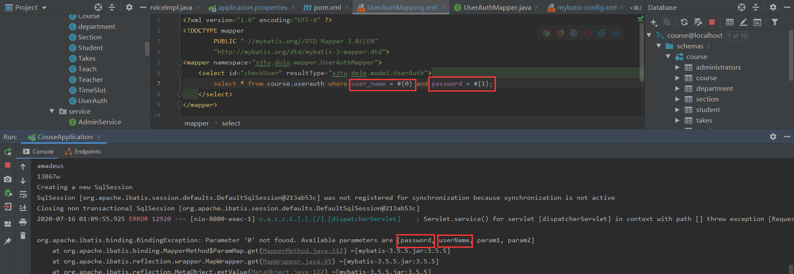
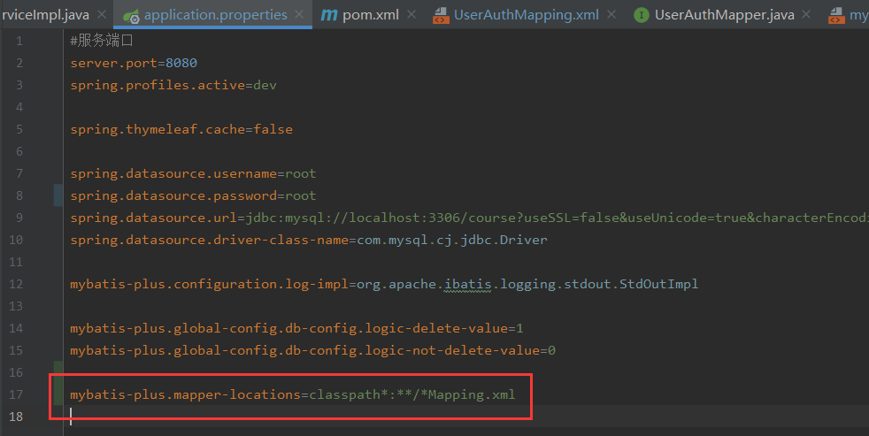
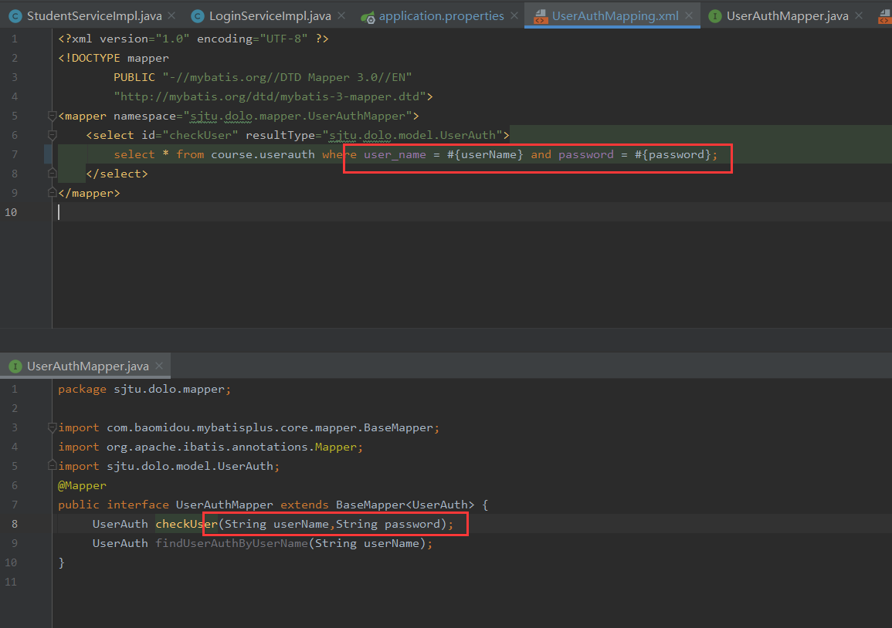

### 问题一

未在 **application.properties** 配置文件中指定 **mapper-locations** 路径：

导致无法识别mapper类对应xml文件

（9小时前金珂新上传至develop分支的版本可能已经将该问题修正，需要进一步测试）

### 问题二

**userAuthMapping.xml** 文件中select语句的参数无法对应

（这个问题在金珂新上传版本中似乎仍存在）

### 最终成果

针对问题一，添加对应配置：

针对问题二，更改参数命名使之与mapper层方法对应：

