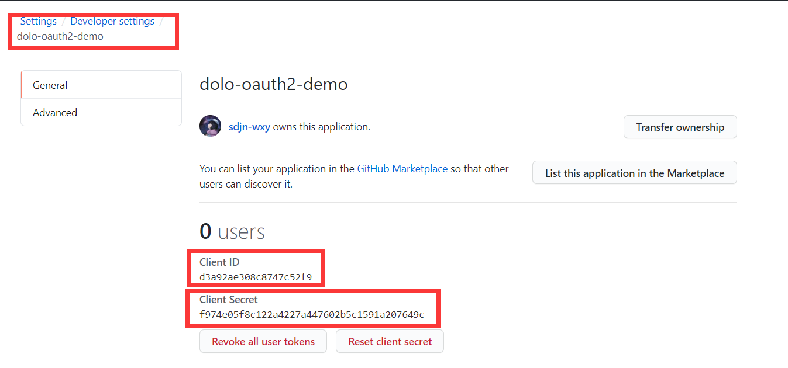

# 基于OAuth2.0的认证登录实现

### OAuth2授权码模式

1. A 网站让用户跳转到 GitHub
2. GitHub 要求用户登录，然后询问"A 网站要求获得 xx 权限，你是否同意？"
3. 用户同意，GitHub 就会重定向回 A 网站，同时发回一个授权码 code ，附在回调地址后
4. A 网站使用授权码，向 GitHub 请求令牌 token
5. GitHub 返回令牌 token
6. A 网站使用令牌，向 GitHub 请求用户数据

### 注册OAuth2.0应用

以我们的后端工程实际操作为例

* 在GitHub上注册自己的网站应用：https://github.com/settings/applications/new

### 授权登录过程

1. **前端页面**

   * 只有一个按钮，向后端发起登录请求

     > GET http://localhost:8080/authorize
     >
     > 

   * 跳转到授权页面

     

   * 用户点击授权，返回登陆结果

2. **后端页面**

   * 接收登录请求后，将请求重定向到GitHub授权服务器

     > “redirect:https://github.com/login/oauth/authorize?client_id=d3a92ae308c8747c52f9&redirect_uri=http://localhost:8080/oauth2/callback”
     >
     > 

   * 用户点击授权后回调登记应用时设置的接口，同时URL上附带了code参数

     > POST https://github.com/login/oauth/access_token?client_id=d3a92ae308c8747c52f9&client_secret=f974e05f8c122a4227a447602b5c1591a207649c&code=d235d4da6c47828ae60d&grant_type=authorization_code
     > 

   * 回调接口中根据code向令牌发放的服务器申请令牌

     > {“access_token”:“24197000ad6136f029de9836169d630b9c532a23”,“token_type”:“bearer”,“scope”:""}
     >
     > 

   * 根据令牌访问授权的信息

     > GET https://api.github.com/user?access_token=24197000ad6136f029de9836169d630b9c532a23
     >
     > 

   * 至此，测试基本完成，接下来要做的是前后端整合与微服务架构的展开