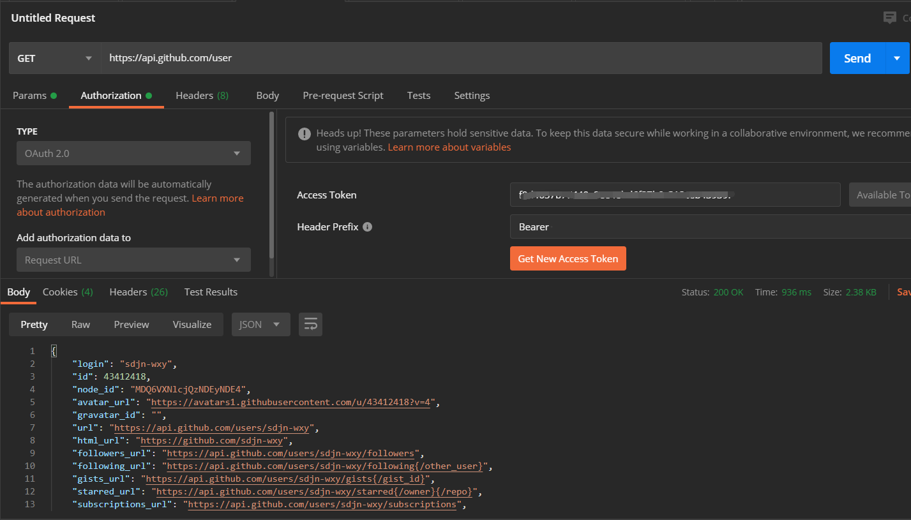

# OAuth2.0登陆问题解决尝试

### 出现的问题：

### 可以正常获取code、access_token，但发送token到github服务器之后会出现异常情况：

截图如下：

1. **情况一：401错误**

   这种错误出现在对后端进行实际测试的时候，截图如下：

   可以观察到，此时**授权码**和**Access Token**均已经成功获取

   

   报错信息为：

   > ```Request processing failed; nested exception is org.springframework.web.client.HttpClientErrorException$Gone: 410 Gone: [{"message":"Hello there, wayfaring stranger. If you’re reading this then you probably didn’t see our blog post a couple of years back announcing that this API would go away: http://git.io/17AROg Fear not, you should be able to get what you need from the shiny new Events API instead.","documentation_url":"https://developer.github.com/v3/activity/events/#list-public-events-performed-by-a-user"}]```

   前往官方文档进行查询，发现github为了安全性考虑，的确在今年五月份左右终止了对OAuth2.0进行url中带有参数的GET请求的支持：

   > https://developer.github.com/changes/2020-02-10-deprecating-auth-through-query-param/

   

   新版官方文档对GET请求格式进行了要求：

   > https://docs.github.com/en/developers/apps/authorizing-oauth-apps

   

   检查代码，工程代码中已经按照新标准，将Access Token放入了Authorization请求头中，故并非这里的问题，截图如下：

   * 请求用户信息方法：

     

   * 调用该方法处：

     

   

2. **情况二：跳转到了用户名为user的github用户的个人主页**

   * 方式一：将上一情况中获取到的Access Token作为请求参数在浏览器中直接输入

     

     输入时截图：

     

     跳转后截图：

     

     

     可以看到，url发生了变化，推测是github进行了自动跳转，跳转到了https://github.com/user这一网址，接下来的验证证实了这一猜想。

     

     

     

   * 方式二：使用Postman进行测试，分别使用已经淘汰的方式和最新的方式：

     首先，使用Postman内置的测试工具，获取Access Token：

     

     

     

     输入回调地址、Client ID、Client Secret等参数（截图中没有输入Scope和State，但也已经测试过输入的情况）截图如下：

     

     点击确认，成功返回Token：

     

     使用该Token进行GET请求，发现结果依旧为刚才看到的名为user的用户主页：

     

     （我吐了）

     这一过程中完全按照Github官方文档规定的方式进行请求与测试，但是结果令人沮丧。（再贴一遍截图）

     

     为了进一步验证，我使用了Github Application中的另一种验证方式：Personal Access Token对接口进行测试：

     

     （我已经提前将这一Token保存在本地）

     结果。。。令人大跌眼镜，为了控制变量，我重新生成了这一Token，并分别采用了官方文档建议的方式和已经淘汰的方式，均能正确获取我的用户信息：

     

     但是！在我写到文档此处，想要再测试一下的时候，奇怪的事情发生了：

     

     它居然又跳转到这个user的主页上了！这不科学啊！Token过期应该提示验证错误啊！你跳到这个人主页上算个毛啊！ToT

     因此，我又测试了一次，将github上的Token进行更新：

     

     

     

     

     果不其然，结果依旧，这次我也是两种方式都试过了

     **太怪了吧！之前明明可以正常获取用户信息，甚至已经成功了不止一次，但是都是偶发现象**

     我吐了并决定尝试使用框架进行OAuth2.0认证（让我哭一会）

     ### 后续

     使用了OkHttp框架作为OAuth登录的载体，但是问题依旧没有解决，返回的还是一个名字叫user的用户的主页

     突然又过了！！！

     

     我人傻了

     而且这次的请求url和oauth认证官方文档还不一样，我裂开，不过这个确实有迹可循，是在另一篇也是更换get请求方式的文章里提到的：

     > https://developer.github.com/changes/2020-02-10-deprecating-auth-through-query-param/
     >
     > 

嗯，OAuth的Access Token也是Access Token，没毛病；

之后在IDEA中进行调试：


？？？timeout

啥情况，我现在又傻了...多试几次


我觉得我有理由怀疑是github自己的问题了，报错信息如下：

```unexpected end of stream on Connection{github.com:443, proxy=DIRECT hostAddress=github.com/140.82.113.3:443 cipherSuite=TLS_ECDHE_RSA_WITH_AES_128_GCM_SHA256 protocol=http/1.1}```


今天的测试就到这里，心累，希望明天可以解决这个问题。