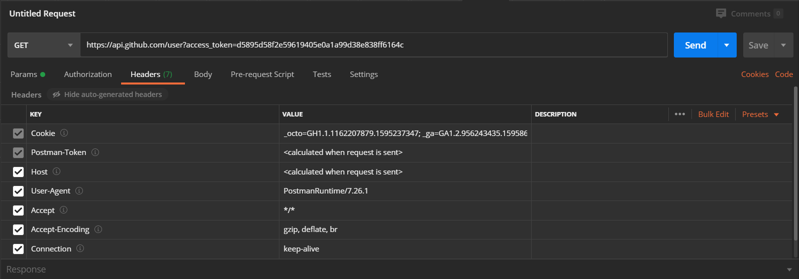

# OAuth2.0登陆异常问题最终解决

### 前言

从早上开始，在Postman上面进行的请求似乎都成功获取到了用户信息，但是IDEA上进行的测试依旧会跳转到user先生（小姐）的个人主页，这令我百思不得其解；

为此，我尝试OkHttp框架的请求解析与Header组装方式，并分别尝试了Github官方推荐与建议弃用的请求方式；但仍像昨天一样，只能获取到Access Token，无法根据Token获取用户信息；

今天中午，龙哥前来支援我的工作。在龙哥的帮助之下，事情终于有了转机；

### 过程

既然Postman可以正常获取用户信息，我们以此为着眼点，寻找Postman所发的请求与IDEA中自行组装的请求的差异：

* 通过输出后端代码中请求实体和请求头中的信息，我们发现Postman会在请求头中默认添加Host、Accept等信息，而IDEA中打印的请求头中似乎并没有。

  

* 因此，我们先在源码中补齐了Postman中具有了Header请求头的传递参数，但是测试发现并没有效果。

* 在测试过程中，我发现自己是开着VPN进行的操作，龙哥敏锐的察觉可能是url换算的问题

* 在关闭VPN后，果然，结果异常跳转到了user的主页

* 经过龙哥的推断，原因应该处在我们为了应对github被DNS污染无法直接访问而做的host配置上】

  

* 注释掉github服务器地址的本机配置文件，再开启VPN，此时后端IDEA可以正常返回用户信息，成功了！

  

  ohhhhhh！

  至此，问题得到解决，可以进行进一步的开发与调试，使之适配现在的后端框架。

  也感谢郑宇宸助教和另一组的陈阳同学在这一过程中的帮助与支持！